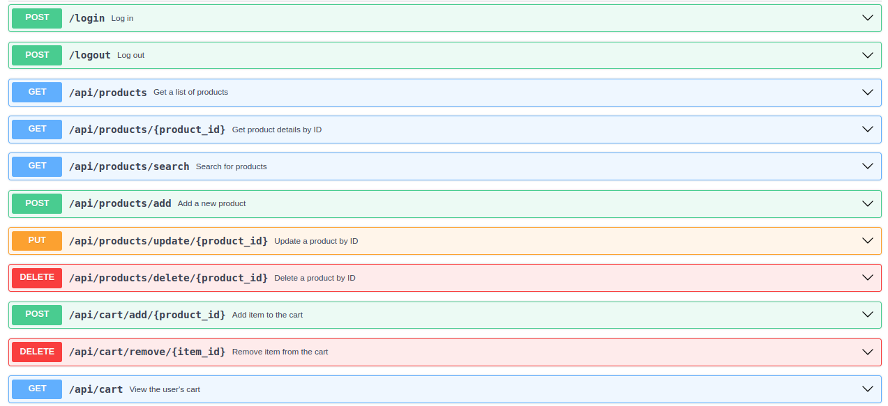

# E-commerce-API

Curso realizado pela Rocketseat, com foco em criar uma API em Python para um E-commerce.

## Sumário

⚪ [Introdução](#introdução)
⚪ [Tecnologias](#tecnologias)
⚪ [Rotas da API](#rotas-da-api)
⚪ [Instalação](#instalação)
⚪ [Autores](#autores)

## Introdução

Este projeto implementa uma API de E-commerce utilizando Python e Flask.

## Tecnologias

As principais tecnologias e ferramentas utilizadas neste projeto são:

- [Python](https://www.python.org/) - Linguagem de programação.
- [Flask](https://flask.palletsprojects.com/en/3.0.x/) - Framework web minimalista para Python.
- [Flask-SQLAlchemy](https://flask-sqlalchemy.palletsprojects.com/en/latest/) - Extensão do Flask para SQLAlchemy.
- [Flask-Login](https://flask-login.readthedocs.io/en/latest/) - Extensão do Flask para autenticação de usuários.
- [Flask-CORS](https://flask-cors.readthedocs.io/en/latest/) - Extensão do Flask para Cross-Origin Resource Sharing (CORS).

## Rotas da API


## Instalação
### _❗Para Linux_

### 1. Verificar se o Python está instalado:

```bash
python --version  # ou python3 --version

```

**ou**

```bash
python3 --version

```

### 2. Instalar o Python (caso necessário):

```bash
sudo apt update
sudo apt install python3 python3-pip python3-venv

```

### 3. Criar um ambiente virtual (Opcional, mas recomendado):

```bash
python3 -m venv venv

```
### 4. Ativar o ambiente virtual:
```bash
source venv/bin/activate

```
### 5. Instalar as dependências do projeto:
### ❗Certifique-se de estar no diretório do projeto, onde o arquivo _requeriments.txt_ está localizado, e execute:

```bash
pip3 install -r requeriments.txt

```
## Autores
Arthur Fernandes Ribeiro Costa

